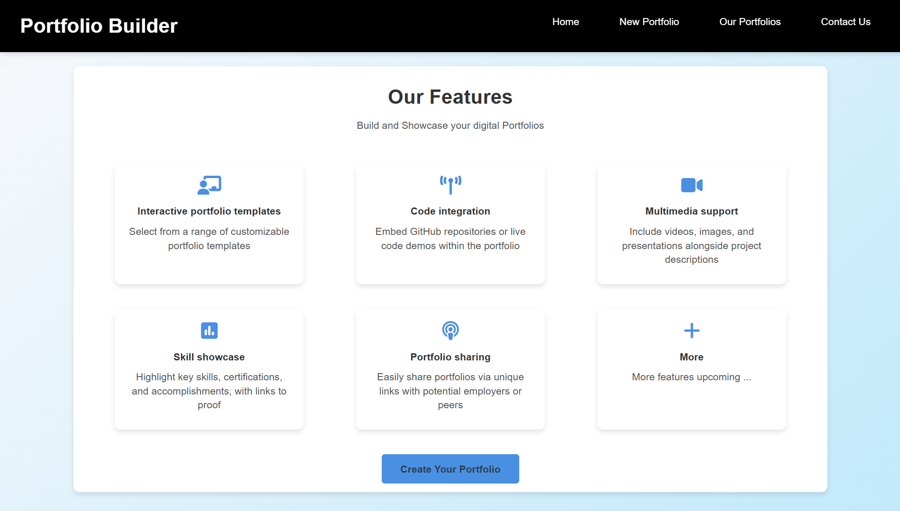

<!-- 
Instruction to Run the web application -->


# Portfolio Builder

Portfolio Builder is a web application that allows users to create, manage, and showcase their digital portfolios. This project is designed to help individuals, especially professionals and students, to present their skills, experiences, and projects in an organized and visually appealing manner.

## Why Portfolio Builder?

In today's competitive job market, having a well-organized and visually appealing portfolio can make a significant difference. Portfolio Builder provides a platform where users can easily create and customize their portfolios, highlighting their key skills, experiences, and projects. This tool is especially useful for:

- Job seekers who want to showcase their skills and experiences to potential employers.
- Students who want to present their academic projects and achievements.
- Freelancers who want to display their work and attract new clients.

## Features

- **Portfolio Management**: Create, edit, and delete digital portfolios with ease.
- **Project Showcase**: Display projects with detailed descriptions, images, and links.
- **Responsive Design**: Enjoy a seamless experience across all devices.
- **Secure Backend**: Manage data with secure API endpoints.
- **Dynamic Frontend**: Interact with an intuitive and dynamic user interface.
- **More Features**: Additional features will be added to enhance the user experience.

## Technologies Used

- **Frontend**: React, React Router, Axios
- **Backend**: Node.js, Express.js
- **Database**: MongoDB
- **Styling**: CSS

## Home Page Preview



## How to Run the Project

### Prerequisites

- Node.js and npm installed on your machine.
- MongoDB instance (local or cloud).

### Backend Setup

1. Clone the repository:
    ```sh
    git clone [<repository-url>](https://github.com/Shorya-Dixit/Portfolio_Builder.git)
    ```
2. Navigate to the backend directory:
    ```sh
    cd backend
    ```

3. Install the dependencies:
    ```sh
    npm install
    ```

4. Update the existing `.env` file in the [`backend/config`](backend/config ) directory with your MongoDB URI and port:
    ```env
    MONGO_URI=<your-mongodb-uri>
    PORT=5001
    ```

4. Start the backend server:
    ```sh
    npm run dev
    ```

### Frontend Setup

1. Navigate to the frontend directory:
    ```sh
    cd frontend
    ```

2. Install the dependencies:
    ```sh
    npm install
    ```

3. Start the frontend development server:
    ```sh
    npm start
    ```

4. Open your browser and navigate to `http://localhost:3000` to view the application.


